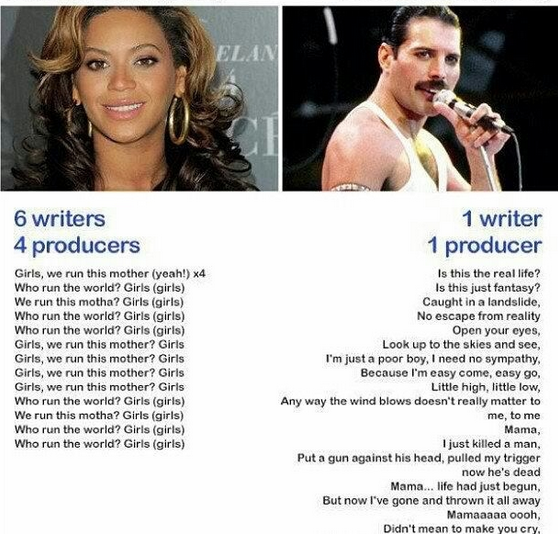

# Applied Data Science at Columbia University
## Spring 2020
## Project 1: Text Analytics on Song Lyrics (Rock vs. Pop)



### [Project Description](doc/)
Term: Spring 2020

+ Project title: **Rock vs. Pop Music: How are they the same? How do they differ?**
+ This project is conducted by Marsya Chairuna (mc4813)
+ Project summary: Rock and Pop fans have stirred up debates across internet forums and websites. Setting aside the chords, how do they actually differ in terms of lyrics and sentiments?

1. *Words and Sentences:* What are the most frequent word(s) used in lyrics for each rock and pop genre? How the length of characters differs?
2. *Sentiment:* Do we have a different type of sentiment/emotion between rock and pop?
3. *Predictability:* Can we predict the whether a song's genre is rock or pop? 

To answer the questions, this project used several techniques of text mining and sentiment analysis of song lyrics of both rock and pop genre. 

The results show that: (1) both genres have similar word-by-word choices and similar average number of words per song. However, rock songs have more songs with significantly large number of words; (2) the lyrics of rock songs tend to be more of negative sentiments, as opposed to those of pop songs are slightly more likely to be positive than negative; (3) the prediction model is yet to be improved in accuracy by adding more data points for pop songs and refining/adding predictors. 


Following [suggestions](http://nicercode.github.io/blog/2013-04-05-projects/) by [RICH FITZJOHN](http://nicercode.github.io/about/#Team) (@richfitz). This folder is organized as follows.

```
proj/
├── lib/
├── data/
├── doc/
├── figs/
└── output/
```

Please see each subfolder for a README file.
